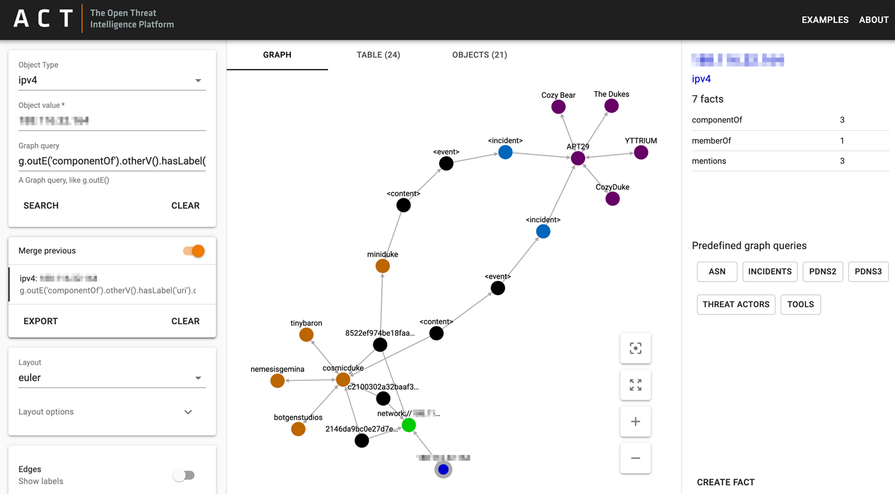
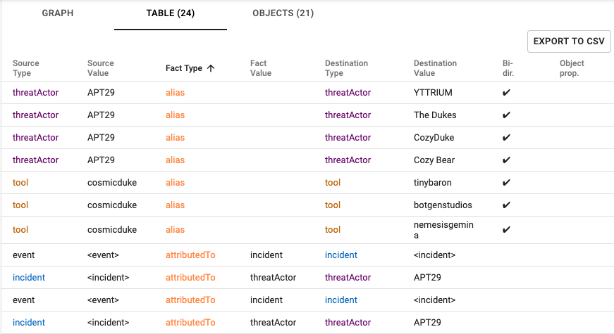

# ACT Frontend

This is the frontend for the [ACT platform](https://github.com/mnemonic-no/act-platform).   

<p></p>

There is also a table view where you can export the data.

<p></p>  


## Installation

```bash
git clone https://github.com/mnemonic-no/act-frontend.git
```

### Install dependencies

You will need to have installed [yarn](https://yarnpkg.com) or [npm](https://www.npmjs.com/get-npm)

```bash
yarn install
```

### Run the development server
Before you can run the app, you have to configure it. During development, the app reads in a config file in 
`src/config.override.json` where you can override settings found in `config.json`.

Copy the `config.override.json.template` to  `config.override.json` and set the relevant API URL for your development 
environment. 

```json
  { "apiUrl": "http://YOUR-API-SERVER-HERE/" }
```

Currently, access control is hard coded, if necessary edit `actUserId`

Change the `banner` property if you want to add a visual indication of the current environment. This can be useful if 
you run multiple instances of ACT. Note that the banner and each of its parameters are optional.

Run development server with:

```bash
yarn start
```

### Deploy

Edit the config.json to reflect your production environment, i.e set the apiUrl for the ACT backend.


```bash
yarn build
```

This will create a folder `build/` with static files ready to be deployed.


### Storybook

[Storybook](https://github.com/storybookjs/storybook) is configured for the project in order to develop UI components in isolation.

```bash
yarn storybook
```
